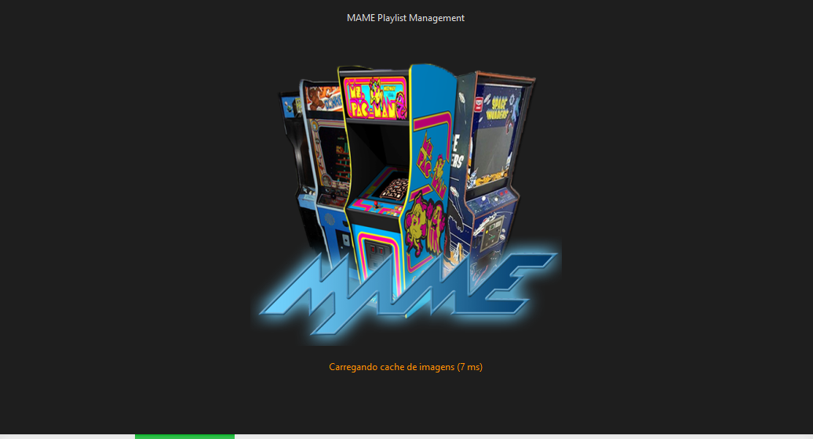
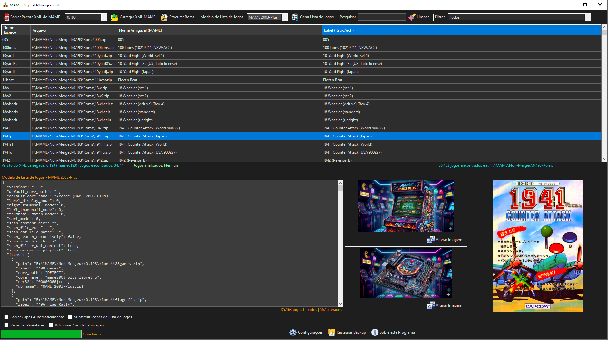
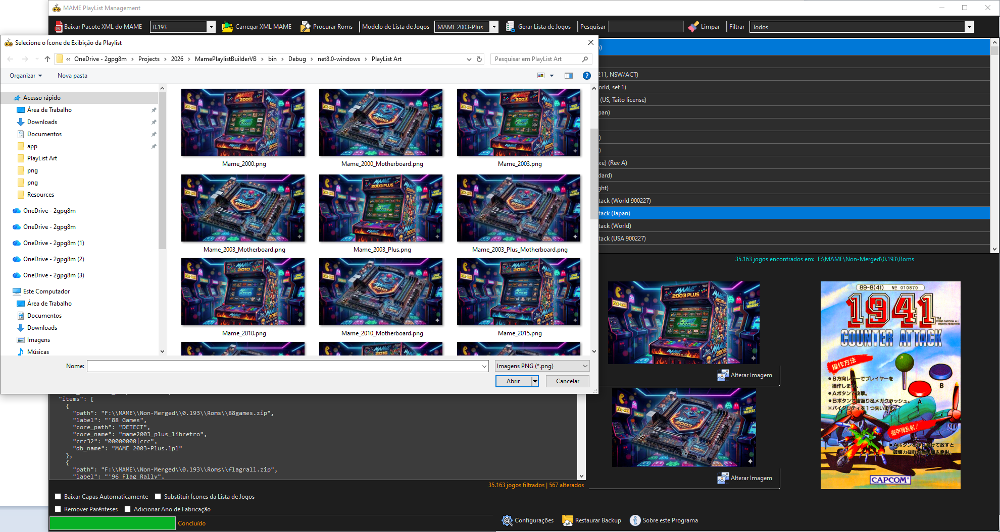
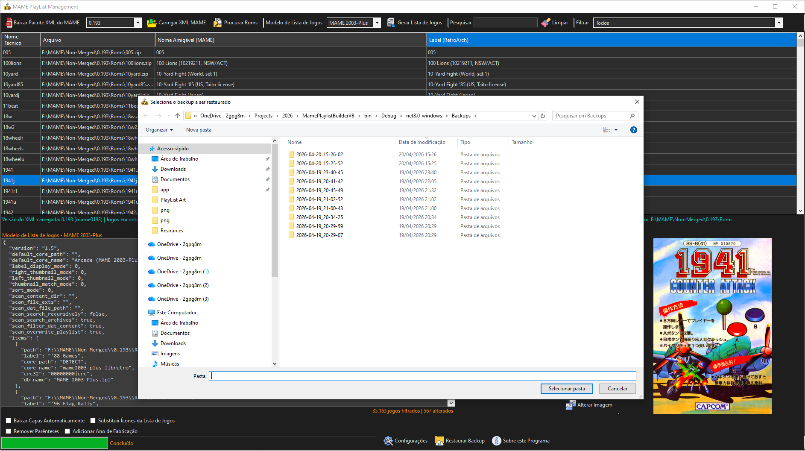
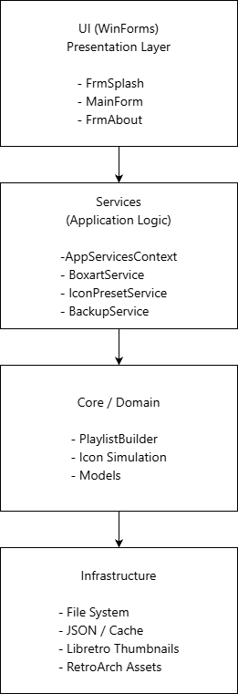
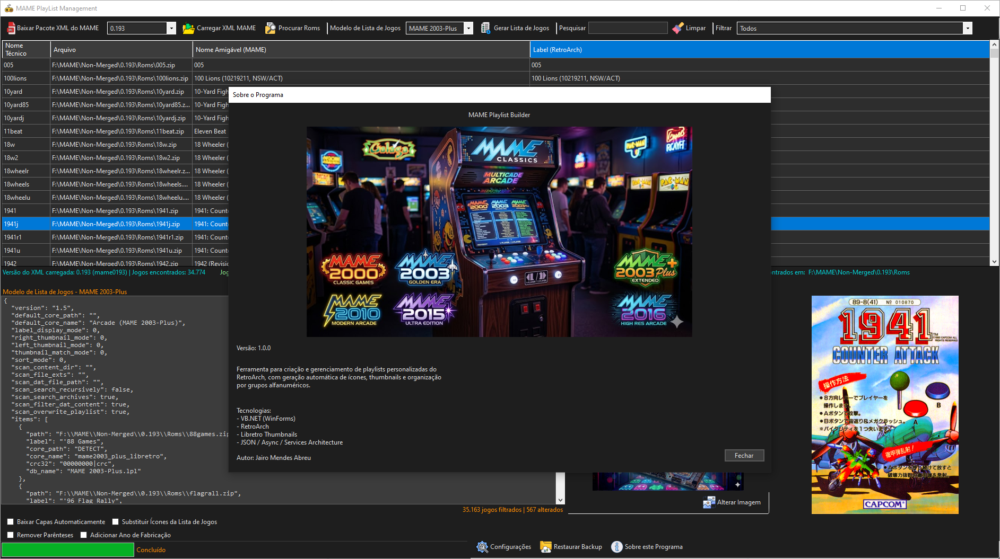

# MAME Playlist Builder

**MAME Playlist Builder** is a desktop application designed to create and manage
custom RetroArch playlists for MAME systems in a practical, safe and organized way.

The application focuses on automation, consistency and user experience, providing
tools that go beyond manual playlist editing.

---

## 🎯 Motivation

Managing RetroArch playlists manually can be time-consuming and error-prone,
especially when dealing with icons, thumbnails and multiple XMB themes.

MAME Playlist Builder was created to automate this process while preserving
existing assets through a safe backup and rollback system.

---

## ✨ Key Features

- ✅ Automatic playlist generation grouped by alphanumeric ranges
- 🎨 Automatic icon generation for XMB themes
- 🖼️ Integration with Libretro thumbnails
- 💾 Selective backup and rollback system for RetroArch assets
- 🌑 Full Dark Theme interface
- 🚀 Splash Screen with real initialization progress
- 🧠 Service-based architecture (clean and maintainable)
- 🔄 Safe overwrite control for existing icons

---

## 🖥️ Screenshots

### Splash Screen

### Main Interface

### Icon Generation Simulation

### Backup and Restore

### Architecture Overview

### About

---

## 🧩 Architecture Overview

The application follows a layered architecture:

- **UI (WinForms)** – Forms only orchestrate actions and display data
- **Services** – Business logic (BoxartService, BackupService, IconPresetService)
- **Core** – Playlist generation, simulation and models
- **Infrastructure** – File system, JSON, cache and external integrations

This separation ensures maintainability, testability and future scalability.

---

## 🛠️ Technologies Used

- **VB.NET (WinForms)**
- **Async / Await**
- **JSON serialization**
- **RetroArch**
- **Libretro Thumbnails**
- **Git**

---

## 🔒 Source Code

The complete source code of this project is maintained in a **private repository**.

This public repository exists for **presentation and documentation purposes only**.

---

## 👤 Author

**Jairo Mendes Abreu**

---

## 📄 License

All rights reserved.
